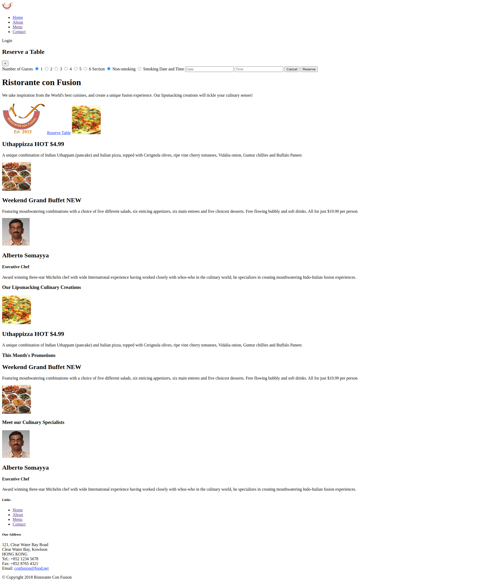

# ProyectoFinal
Carlos, su mentor piensa estudiar ingeniería en computación porque le apasiona programar, se inscribió a un curso donde le piden entreguè un proyecto final. Carlos creo varias ramas para trabajar su proyecto y ¡Oh Sorpresa! Se quedó sin internet antes de unirlas, tu trabajo es ayudar a Carlos a unir sus ramas de tal forma que la versión final del proyecto se vea de la siguiente forma:

